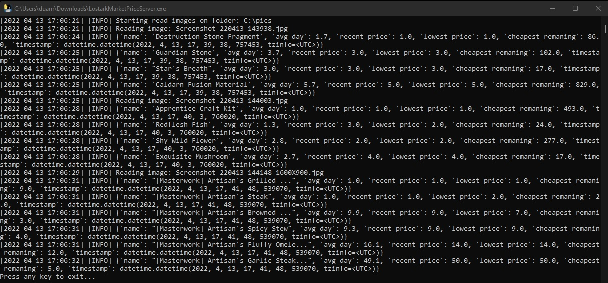
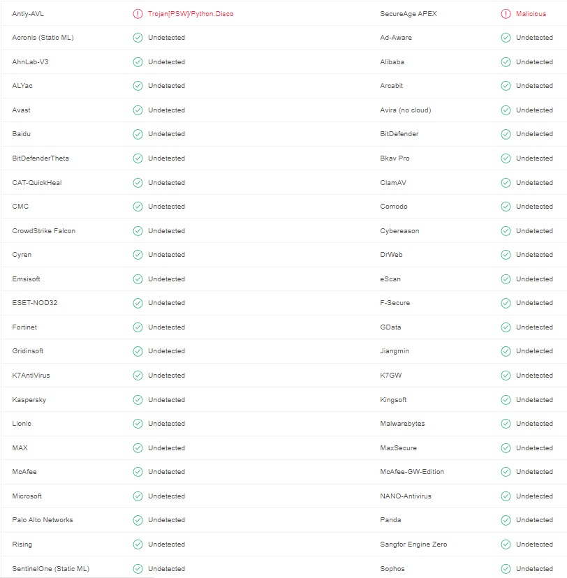

# Lost Ark - Price Market History (On progress...)

The objective of this project is a tool that collects information from [Lost Ark](https://www.playlostark.com/pt-br) game screenshots, interprets the text through 
[Amazon Rekognition](https://aws.amazon.com/pt/rekognition/) and saves the information in a cloud database to be searched by all players

## 1. Requirements
* Only works on Windows.
* Must use in-game resolution 1920x1080 or 1600x900. (Because the code will crop the market text and other resolution will be offcenter and fail)

## 2. Installation
* Download file `LostarkMarketPriceServer.exe` (You dont need any other files)
* Create a folder on path `C:\pics` (MAKE SURE IS ON C:)

## 3. In-game Screenshots
* Open the game as usual and login on any character.
* When inside use hotkey `ALT + Y` to open the market.
* Search for the itens you want to collect data and take a screenshot using hotkey `printscreen`
* Take the screenshots on your steam folder `C:\SteamLibrary\steamapps\common\Lost Ark\EFGame\Screenshots` and move to the new folder `C:\pics`

!!! DONT MOVE IN-GAME MARKET WINDOW, THE CODE WILL CROP THE TEXT AND IF YOU MOVE FROM DEFAULT POSITION WILL FAIL !!!
If you moved the market window for some reason, just switch characters or re-login to make the window on default location.

## 4. Run the code
* Open `LostarkMarketPriceServer.exe`

## FAQ
* **Is this a Virus?**

You can check this .exe file on https://www.virustotal.com/ and the code is here to look, for sure some antivirus will accuse this script as a virus if this happen you can turn off antivirus or just give up.

* **Can i be banned from Lost Ark?**

This code was designed not to interact directly with the game, through clicks or any type of action, precisely to 
avoid banning the user's account.The code will interact with screenshots taken by the user and there is no need for the game to even be open for
gathering information.

## Contributing
Pull requests are welcome. For major changes, please open an issue first to discuss what you would like to change.

